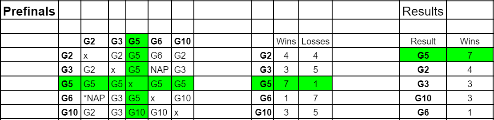

# Starcraft BroodWar bot.
Project in KTH course DD2438. We (me and Minghua Lu) were group 5. Our task was to program a bot to play Starcraft: Brood War and play a 
tournament against the other groups in the course. We managed to win all of our games in the final. 

## Abstract from the report
With e-sports getting popular over the years, there has been an incentive to create artificial intelligence that can beat humans, either
to prove that AI is better than real players or for prize money. Using BWAPI, we can interact and write code for the real-time strategy
game Starcraft: Brood War. We built an AI with a pre-existing bot
template, StarterBot from UAlbertaBot, link [here](https://github.com/davechurchill/ualbertabot/wiki). 
By adding basic but effective macro and micro tactics to an established build order with a few
improvements, we created an AI capable of adapting to the current
stage of the game and beating the default AI in the game. In a small
tournament with other AIs, our bot achieved outstanding results, winning every game in the final round. Further work includes observing
the enemy team’s actions and allowing the AI to make strategic decisions based on them, which could make the AI able to defeat real
players.

See more information in the project report.  

## Tournament results
Results from pre-final tournament (7 wins, 1 loss):

Results from final tournament (8 wins, 0 losses):

The whole game against group 2 can be found [HERE](https://drive.google.com/file/d/1Pi7cG4bkyYbAOJQ3EqzS0YPjx4b8pWoF/view?usp=sharing). We are the orange team. The ending of the game can be seen here:

https://github.com/Calle-Lundqvist/StarcraftBW_bot/assets/85300362/f3082592-8f83-40b8-965c-fde4597d26bc.mp4

Here is a video where our Stalkers takes advantage of their attack range to defeat the opponent's units:

https://github.com/Calle-Lundqvist/StarcraftBW_bot/assets/85300362/97aad87d-ec8c-4dca-b4a7-041fdeaa59f0.mp4

When an enemy gets close, our Stalker runs away. 

More videos and images can be found in the *Images_and_videos* folder.

To play against our bot, follow the instructions in UAlbertaBot and run our *StarterBot_grp5_finals.exe* (found in /Bot) as the enemy.
